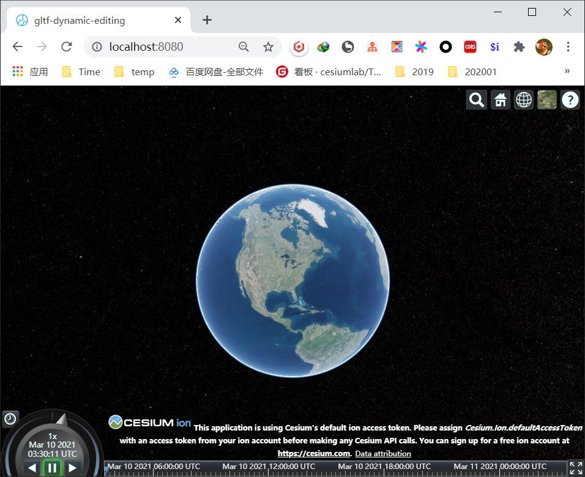
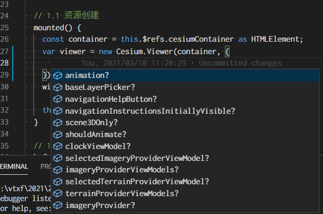
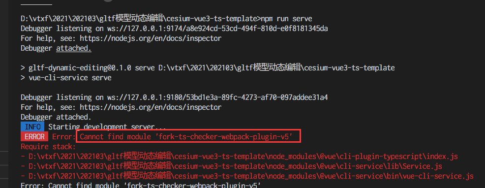
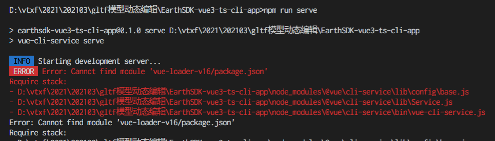

# Cesium + Vue3 + Typescript项目开发模板

北京西部世界 vtxf 2021/3/10

### 效果预览


### 特点


建议使用JS开发Cesium项目的同学，可以尝试使用此模板(Typescript)来开发。该模板中ts和js可以混合使用。  
1. 使用Cesium API时，会有比较好的代码提示  




2. Typescript可以帮助提前解决语法错误，提高开发效率  

3. Vue组件的使用请参考 https://github.com/vuejs/vue-class-component

4. 此项目亦可写入js代码，但是如果该js文件需要被其他ts文件引用，需要编写相应的d.ts声明文件，可查看testjs文件夹中的示例代码
注意：只有需要被ts引用的js文件才需要编写d.ts声明文件。也就是说，对于不暴露接口的js文件，直接使用即可。

### 项目安装
```
npm install
```

### 编译加热更新
```
npm run serve
```

### 编译压缩
```
npm run build
```

### 自定义项目配置
请看 [Configuration Reference](https://cli.vuejs.org/config/).

### 注意点：
1 npm run serve偶尔是运行失败，弹出以下错误，您可以试试再次npm install。  
  

2 如果出现以下错误，  
  
解决办法：  
可以重新安装一下 vue-loader-v16：  
npm uninstall vue-loader-v16  
npm install vue-loader-v16  

### Project setup
```
npm install
```

### Compiles and hot-reloads for development
```
npm run serve
```

### Compiles and minifies for production
```
npm run build
```

### Customize configuration
See [Configuration Reference](https://cli.vuejs.org/config/).